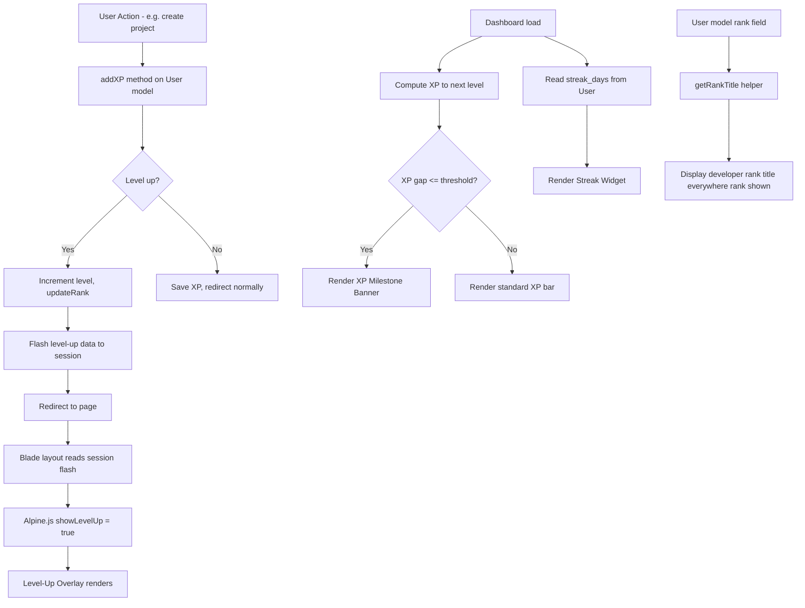
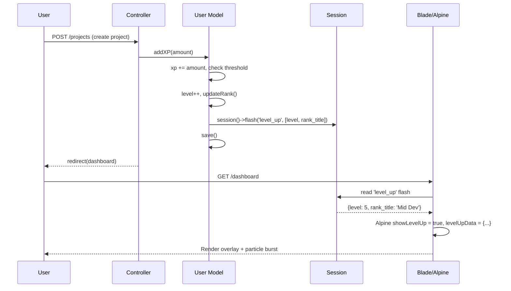
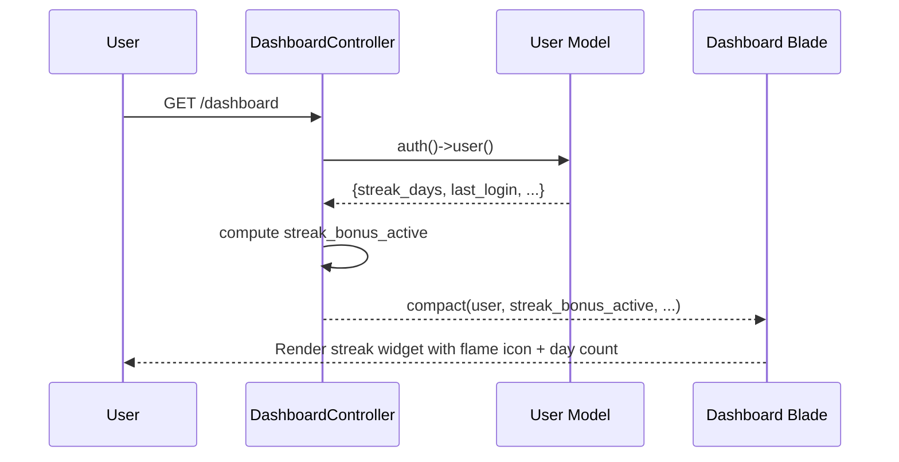

# Design Document: Gamification Feedback & Engagement

## Overview

LvlUp currently tracks XP, levels, ranks, and daily login streaks in the database but surfaces almost none of this progress to the user in a meaningful, motivating way. Level-ups happen silently, rank titles are generic, XP milestones are invisible, and streaks exist only as a number. This feature closes that gap by wiring up four high-impact feedback loops: a dramatic level-up celebration overlay, developer-identity rank titles, XP milestone urgency nudges on the dashboard, and a visible streak tracker with bonus indicators.

The implementation is entirely frontend-first for the celebration/notification layer (Alpine.js + CSS animations), with minimal backend changes limited to rank title mapping and a session flash mechanism to pass level-up events from `addXP()` to the view layer.

## Architecture



## Sequence Diagrams

### Level-Up Flow



### Streak Display Flow



## Components and Interfaces

### Component 1: Level-Up Overlay

**Purpose**: Full-screen celebration moment triggered when a user gains a level. Renders on top of all content, auto-dismisses after 4 seconds or on click.

**Interface** (Alpine.js x-data on `<body>`):
```javascript
{
    showLevelUp: false,
    levelUpData: { level: null, rankTitle: null, isRankUp: false },
    triggerLevelUp(data) { /* sets state, auto-dismiss timer */ },
    dismissLevelUp() { /* clears state */ }
}
```

**Responsibilities**:
- Read `level_up` session flash injected as a JS variable in the Blade layout
- Animate in with scale + opacity transition
- Show particle burst effect (CSS keyframe animation)
- Display new level number, new rank title, and rank-up badge if rank changed
- Auto-dismiss after 4 seconds; also dismissible on click/tap

### Component 2: Rank Title System

**Purpose**: Maps the existing `rank` field values to developer-identity titles and exposes them throughout the UI.

**Interface** (PHP helper on User model):
```php
public function getRankTitle(): string
// Returns developer title for current rank

public static function rankTitleMap(): array
// Returns full mapping array
```

**Rank Mapping**:
| DB Value | Level Range | Developer Title | Color Theme |
|----------|-------------|-----------------|-------------|
| Bronze   | 1–9         | Junior Dev      | amber/orange |
| Silver   | 10–24       | Mid Dev         | slate/blue   |
| Gold     | 25–49       | Senior Dev      | yellow/gold  |
| Platinum | 50–74       | Tech Lead       | cyan/teal    |
| Diamond  | 75–99       | Architect       | violet/indigo |
| Master   | 100+        | Legend          | pink/mythic gradient |

**Responsibilities**:
- Provide `getRankTitle()` method on User model
- Replace all raw `$user->rank` display strings with `$user->getRankTitle()`
- Apply rank-specific color classes in sidebar, dashboard stat card, and public profile

### Component 3: XP Milestone Banner

**Purpose**: Urgency nudge shown on the dashboard when the user is within a configurable XP threshold of the next level.

**Interface** (Blade partial, data from DashboardController):
```php
// DashboardController passes:
$xpToNextLevel = $user->xpNeededForNextLevel() - $user->xp;
$milestoneThreshold = 100; // XP gap that triggers the banner
$showMilestoneBanner = $xpToNextLevel <= $milestoneThreshold;
```

**Responsibilities**:
- Render a glowing banner above the XP progress bar when `$showMilestoneBanner` is true
- Show exact XP gap: "You're 47 XP away from Level 6!"
- Pulse animation to draw attention
- Link to projects page as the primary XP-earning action

### Component 4: Streak Widget

**Purpose**: Surfaces the existing `streak_days` field visually on the dashboard with a flame icon, day count, and bonus indicator.

**Interface** (Blade partial):
```php
// Data available from User model:
$user->streak_days       // integer, days in current streak
$user->last_login        // Carbon date
$streakBonusActive       // bool: streak >= 3 days = bonus active
$streakBonusMultiplier   // float: 1.0 base, +0.1 per 3 days, max 2.0
```

**Responsibilities**:
- Show flame icon (animated when streak >= 3) with day count
- Display "Streak Bonus Active: +X% XP" when applicable
- Show "Login tomorrow to keep your streak!" if last_login was today
- Integrate into the Quick Stats grid on the dashboard

## Data Models

### Session Flash: level_up

```php
// Written in User::addXP() on level-up
session()->flash('level_up', [
    'new_level'    => $this->level,       // int
    'rank_title'   => $this->getRankTitle(), // string e.g. "Senior Dev"
    'old_rank'     => $previousRank,      // string, DB value before update
    'new_rank'     => $this->rank,        // string, DB value after update
    'is_rank_up'   => $previousRank !== $this->rank, // bool
]);
```

### Streak Bonus Calculation

```php
// In DashboardController or User model helper
public function streakBonusMultiplier(): float
{
    // +10% per 3-day tier, capped at 2.0x (100% bonus)
    $tiers = (int) floor($this->streak_days / 3);
    return min(1.0 + ($tiers * 0.1), 2.0);
}

public function streakBonusActive(): bool
{
    return $this->streak_days >= 3;
}
```

### Rank Title Map (User Model)

```php
private const RANK_TITLES = [
    'Bronze'   => 'Junior Dev',
    'Silver'   => 'Mid Dev',
    'Gold'     => 'Senior Dev',
    'Platinum' => 'Tech Lead',
    'Diamond'  => 'Architect',
    'Master'   => 'Legend',
];
```

## Algorithmic Pseudocode

### Level-Up Detection & Flash

```pascal
PROCEDURE addXP(amount)
  INPUT: amount (positive integer)
  
  SEQUENCE
    previousRank ← this.rank
    this.xp ← this.xp + amount
    this.total_xp ← this.total_xp + amount
    
    WHILE this.xp >= this.xpNeededForNextLevel() DO
      this.xp ← this.xp - this.xpNeededForNextLevel()
      this.level ← this.level + 1
      this.updateRank()
      
      // Flash level-up event for UI layer
      session().flash('level_up', {
        new_level:  this.level,
        rank_title: this.getRankTitle(),
        old_rank:   previousRank,
        new_rank:   this.rank,
        is_rank_up: previousRank != this.rank
      })
      
      previousRank ← this.rank
    END WHILE
    
    this.save()
  END SEQUENCE
END PROCEDURE
```

**Preconditions**: `amount > 0`, user is persisted in DB
**Postconditions**: `xp`, `total_xp`, `level`, `rank` updated; session flash set if level-up occurred
**Loop Invariant**: After each iteration, `this.xp < xpNeededForNextLevel()` for the new level

### Streak Bonus Multiplier

```pascal
FUNCTION streakBonusMultiplier()
  OUTPUT: multiplier (float, 1.0 to 2.0)
  
  SEQUENCE
    tiers ← FLOOR(this.streak_days / 3)
    multiplier ← MIN(1.0 + (tiers * 0.1), 2.0)
    RETURN multiplier
  END SEQUENCE
END FUNCTION
```

**Preconditions**: `streak_days >= 0`
**Postconditions**: Returns value in range [1.0, 2.0]

### XP Milestone Detection

```pascal
FUNCTION shouldShowMilestoneBanner(threshold = 100)
  OUTPUT: boolean
  
  SEQUENCE
    xpGap ← this.xpNeededForNextLevel() - this.xp
    RETURN xpGap <= threshold AND xpGap > 0
  END SEQUENCE
END FUNCTION
```

## Key Functions with Formal Specifications

### User::getRankTitle()

```php
public function getRankTitle(): string
```

**Preconditions**: `$this->rank` is one of: Bronze, Silver, Gold, Platinum, Diamond, Master
**Postconditions**: Returns non-empty developer title string; falls back to raw rank value if unknown

### User::streakBonusMultiplier()

```php
public function streakBonusMultiplier(): float
```

**Preconditions**: `$this->streak_days >= 0`
**Postconditions**: Return value `r` satisfies `1.0 <= r <= 2.0`

### DashboardController::index()

```php
public function index(): View
```

**Postconditions**: View receives `xpToNextLevel`, `showMilestoneBanner`, `streakBonusActive`, `streakBonusMultiplier` in addition to existing `projects` variable

## Example Usage

```php
// User model usage
$user->getRankTitle();           // "Senior Dev"
$user->streakBonusMultiplier();  // 1.3 (for 9-day streak)
$user->streakBonusActive();      // true

// In addXP - level-up flash
$user->addXP(200);
// If level-up occurred: session has 'level_up' flash data

// In Blade layout - reading flash for Alpine
@if(session('level_up'))
<script>
    document.addEventListener('alpine:init', () => {
        window._levelUpData = @json(session('level_up'));
    });
</script>
@endif

// Alpine.js body x-data init
{
    showLevelUp: false,
    levelUpData: {},
    init() {
        if (window._levelUpData) {
            this.levelUpData = window._levelUpData;
            this.showLevelUp = true;
            setTimeout(() => this.showLevelUp = false, 4000);
        }
    }
}
```

## Correctness Properties

- For all users, `getRankTitle()` returns a non-empty string
- For all `streak_days >= 0`, `streakBonusMultiplier()` returns a value in `[1.0, 2.0]`
- The level-up flash is set at most once per `addXP()` call (last level-up wins if multiple levels gained)
- `showMilestoneBanner` is `false` when `xpToNextLevel > threshold` or `xpToNextLevel <= 0`
- The level-up overlay auto-dismisses after exactly 4 seconds if not manually dismissed
- Rank title display is consistent: same title shown in sidebar, dashboard, and public profile

## Error Handling

### Unknown Rank Value

**Condition**: `$user->rank` contains a value not in `RANK_TITLES` map (e.g. data migration edge case)
**Response**: `getRankTitle()` falls back to returning the raw `rank` value
**Recovery**: No crash; display degrades gracefully to existing behavior

### Missing Session Flash

**Condition**: Page load with no `level_up` session key (normal case)
**Response**: `window._levelUpData` is not set; Alpine `init()` checks `if (window._levelUpData)` before triggering overlay
**Recovery**: No overlay shown; no JS errors

### Zero Streak Days

**Condition**: `streak_days = 0` (new user or broken streak)
**Response**: Streak widget shows "Start your streak today!" with a neutral icon; no bonus displayed
**Recovery**: Normal display, no bonus multiplier applied

## Testing Strategy

### Unit Testing (Pest PHP)

Key test cases for model methods:

```php
it('returns correct rank title for each rank value', function () {
    $rankMap = ['Bronze'=>'Junior Dev','Silver'=>'Mid Dev','Gold'=>'Senior Dev',
                'Platinum'=>'Tech Lead','Diamond'=>'Architect','Master'=>'Legend'];
    foreach ($rankMap as $rank => $title) {
        $user = User::factory()->make(['rank' => $rank]);
        expect($user->getRankTitle())->toBe($title);
    }
});

it('streak bonus multiplier is capped at 2.0', function () {
    $user = User::factory()->make(['streak_days' => 999]);
    expect($user->streakBonusMultiplier())->toBe(2.0);
});

it('streak bonus is inactive below 3 days', function () {
    $user = User::factory()->make(['streak_days' => 2]);
    expect($user->streakBonusActive())->toBeFalse();
});

it('flashes level_up session data when level increases', function () {
    $user = User::factory()->create(['level' => 1, 'xp' => 0]);
    $user->addXP(200); // enough to level up from 1
    expect(session('level_up'))->not->toBeNull();
    expect(session('level_up.new_level'))->toBeGreaterThan(1);
});

it('milestone banner shows when xp gap is within threshold', function () {
    $user = User::factory()->make(['level' => 5, 'xp' => 350]);
    // xpNeededForNextLevel at level 5 = 100 * 5^1.5 ≈ 1118; gap = 768 > 100
    expect($user->shouldShowMilestoneBanner())->toBeFalse();
    
    $user2 = User::factory()->make(['level' => 5, 'xp' => 1070]);
    // gap = ~48 XP, within 100 threshold
    expect($user2->shouldShowMilestoneBanner())->toBeTrue();
});
```

### Property-Based Testing

**Property Test Library**: Pest PHP with custom generators (or raw PHPUnit data providers)

```php
it('streak multiplier always stays in [1.0, 2.0] range', function (int $days) {
    $user = User::factory()->make(['streak_days' => $days]);
    $multiplier = $user->streakBonusMultiplier();
    expect($multiplier)->toBeGreaterThanOrEqual(1.0)
                       ->toBeLessThanOrEqual(2.0);
})->with(fn() => array_map(fn($n) => [$n], range(0, 500)));
```

### Feature Testing

```php
it('dashboard includes streak and milestone data', function () {
    $user = User::factory()->create(['streak_days' => 5, 'level' => 3, 'xp' => 0]);
    actingAs($user)->get('/dashboard')
        ->assertStatus(200)
        ->assertViewHas('streakBonusActive', true)
        ->assertViewHas('showMilestoneBanner');
});

it('level up flash is present after xp gain triggers level up', function () {
    $user = User::factory()->create(['level' => 1, 'xp' => 90]);
    actingAs($user);
    // Simulate XP gain via project creation
    post('/projects', [...validProjectData(), 'xp_reward' => 50]);
    expect(session('level_up'))->not->toBeNull();
});
```

## Performance Considerations

- All new data (`getRankTitle`, `streakBonusMultiplier`, `shouldShowMilestoneBanner`) is computed from already-loaded User model fields — zero additional DB queries
- Session flash is a single key write; no performance impact
- Level-up overlay and particle animations are pure CSS/Alpine — no JS library overhead
- Streak widget reuses `streak_days` already on the User model; no new columns needed

## Security Considerations

- Session flash data is server-generated and not user-controllable; no XSS risk from flash values
- `@json(session('level_up'))` output in Blade must use Laravel's built-in JSON escaping (default behavior) — no raw `{!! !!}` usage
- No new routes or form submissions introduced by this feature

## Dependencies

- Alpine.js 3+ (already loaded in layout) — for overlay state management
- Font Awesome 6 (already loaded) — flame icon (`fa-fire`), crown (`fa-crown`), bolt (`fa-bolt`)
- Tailwind CSS 3+ (already loaded) — all styling via utility classes
- Laravel session flash (built-in) — level-up event transport
- No new Composer or npm packages required
